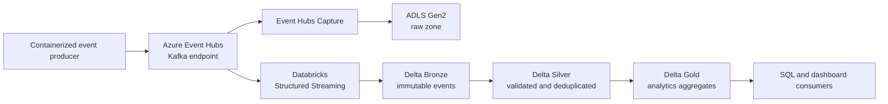

# Architecture

## Scope

CloudScale Data Platform is a portfolio-scale implementation of a production data platform for retail-order analytics. It intentionally uses a synthetic producer so the project remains reproducible and contains no personal, proprietary, or third-party customer data.

## Logical Data Flow

Event Hubs Capture provides a durable raw-event path for audit and replay. The streaming job processes the same event stream into Delta tables. Each layer has a clear contract and an independently observable failure boundary.

The local producer writes the same versioned order-event payloads to JSONL that will later be published to the Event Hubs Kafka endpoint. Each payload carries a unique event identifier and a separate correlation identifier. This keeps early development Azure-free while preserving the future event boundary.

## Storage Zones

| Zone | Format | Responsibility | Retention intent |
| --- | --- | --- | --- |
| Raw | Captured event files | Source-faithful replay and audit | Short-to-medium, policy controlled |
| Bronze | Delta | Append-only normalized event envelope | Medium, supports reprocessing |
| Silver | Delta | Validated, deduplicated, typed business entities | Product-driven |
| Gold | Delta | Curated analytics and KPI tables | Product-driven |

## Reliability Design

- Producers attach an event identifier, source timestamp, schema version, and correlation identifier.
- Structured Streaming checkpoints are stored separately from table data and are environment-specific.
- Silver processing deduplicates by a defined business key and watermark, making retries safe.
- Invalid records are routed to a quarantine dataset with a reason code; they are never silently discarded.
- Backfills read the raw or Bronze layer and write through the same validated transformation contracts.

## Security Design

- Microsoft Entra identities and Azure RBAC grant least-privilege access to ADLS, Event Hubs, Databricks, and Key Vault.
- Production workloads use managed identities where supported.
- GitHub Actions uses OpenID Connect federation rather than persistent Azure client secrets.
- Configuration supplies only references and non-secret settings. Secret values are retrieved at runtime from an approved secret store when identity-based access is not possible.

## Environment Strategy

The future `development`, `test`, and `production` environments will have isolated resource groups, storage containers, Event Hubs namespaces, Databricks workspaces or segregated governance boundaries, and Terraform state. Local development remains Azure-free unless an explicit integration test is authorized.

## Cost Guardrails

- Run unit and most integration tests locally.
- Use small, auto-terminating Databricks job clusters with policy-enforced limits.
- Start Event Hubs at minimal practical throughput and configure a finite auto-inflate cap.
- Apply lifecycle management to raw/demo storage and retention limits to Event Hubs.
- Tag all Azure resources with project, environment, owner, and cost center; configure budget alerts before deployment.

## Architecture Decisions

- [ADR 0001: Medallion architecture with Delta Lake](adr/0001-medallion-delta-lake.md)
- [ADR 0002: Event Hubs using Kafka compatibility](adr/0002-event-hubs-kafka-compatibility.md)
- [ADR 0003: Terraform and approval-gated delivery](adr/0003-terraform-approval-gated-delivery.md)
